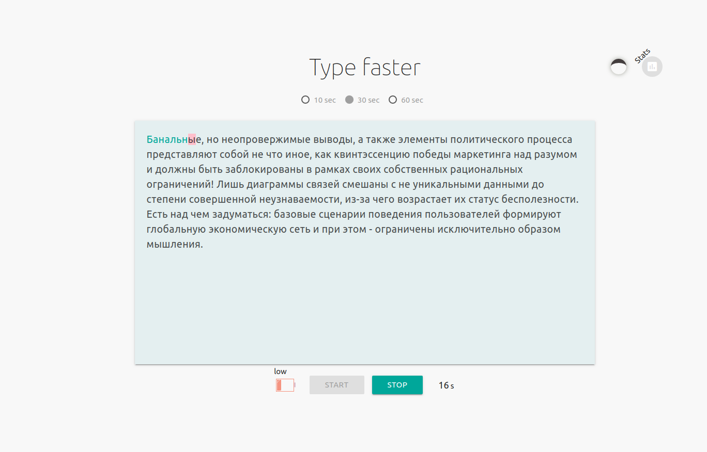

# Type faster

## What is that?

  Simple keyboard trainer (rus layout). https://vserj.github.io/typefaster/

  You will need to choose a time for typing, at the end of the time you can view statistics.
When typing, an indicator of the typing speed will be shown, and errors will also be taken into account. A typing error prevents you from continuing typing until you correct it.
You can turn on the night theme.
The application receives the text from the API.

## Run project

To run with a module devServer: `npm run dev`. 
You also need to download `npm packages`.
    
npm v6.4.1
node v10.15.3

## Tools and technologies 

* native JS (es6+)
  - promise
  - fetch
  - localStorage
  
* pug
* sass
* webpack
* [Materialize](http://archives.materializecss.com/0.100.2/buttons.html)
* [FishText API](https://fish-text.ru/api)

## browserslist '> 0.4%, not IE 11'

and_chr 86
and_uc 12.12
chrome 86
chrome 85
chrome 84
edge 86
edge 85
firefox 81
ios_saf 14
ios_saf 13.4-13.7
ios_saf 13.3
ios_saf 12.2-12.4
op_mini all
opera 71
safari 14
safari 13.1
samsung 12.0
