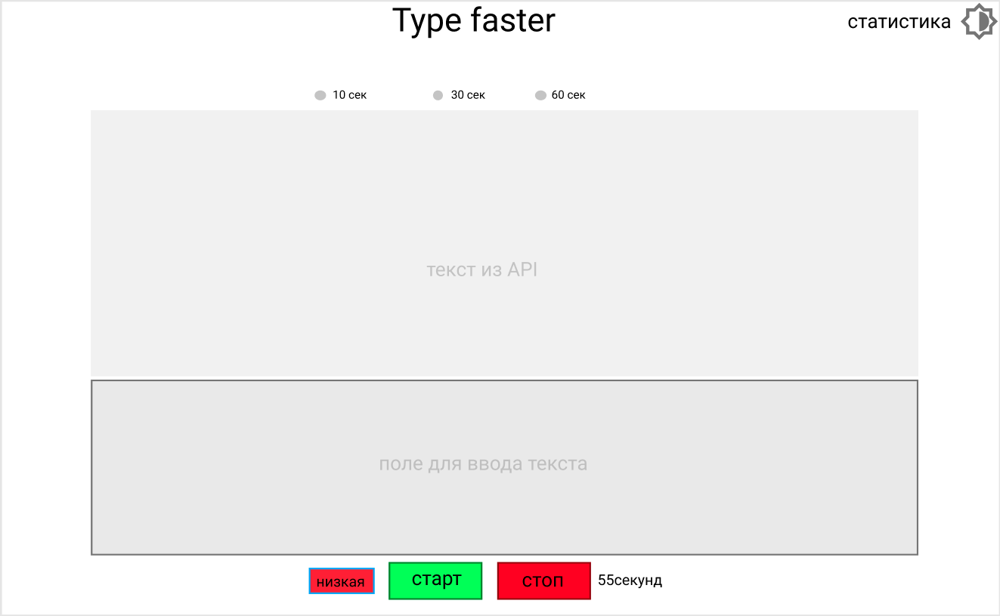

# Type faster task

*приблизительный макет

## Задача

Написать тренажер для набора текста.

## Описание

 * пользователь открывает тренажер
 * выбирает количество времени для тренажера (**10** / **30** / **60** секунд)
 * пользователь запускает тренажер
 * получить сгенерированый текст из **API** (ссылка на **API** в Доках)
 * вывести его на экран
 * запустить таймер (с количество времени из выбраного *пункта 2*)
 * пользователь будет вводить текст в текстовое поле
 * по окончании таймера вывести результат на экран (набраное им количество символов за выбранное количество секунд в тренажере)

## Требования

  * при неправильном наборе (неверно набраном символе) подсветить ошибку и не дать возможности дальше продолжать набор текста, пока не будет удалена ошибка
  * подсчитывать количество ошибок для каждого сеанса тренажера
  * адаптивный для мобильных устройств
  * сохранять в браузере статистику всех предыдущих результатов в виде списка. список должен хранить результат каждой попытки и включать в себя:
    - результат количества набраных слов в минуту
    - количество ошибок (*пункт 2*)
    - дату сеанса тренажера (дату очередной тренировки)
  * учитывать реестр символов при наборе
  * разработать индикатор скорости набора текста, который будет визуально указывать скорость набора текста при каждом сеансе. индикатор скорости должен плавно менять свой цвет (в зависимости от скорости набора текста):
    - красный - скорость набора очень медленная
    - зеленый - скорость набора отличная
  * добавить тёмную (ночую) тему

## Доки

[FishText API](https://fish-text.ru/api) - API для получения случайного текста.    
[Materialize](http://archives.materializecss.com/0.100.2/buttons.html) - библиотека для стилизации компонентов (аля *Bootstrap*)
